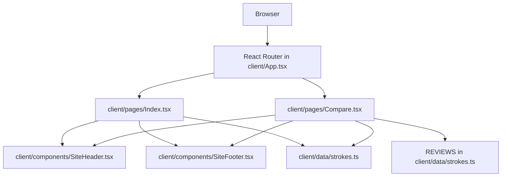
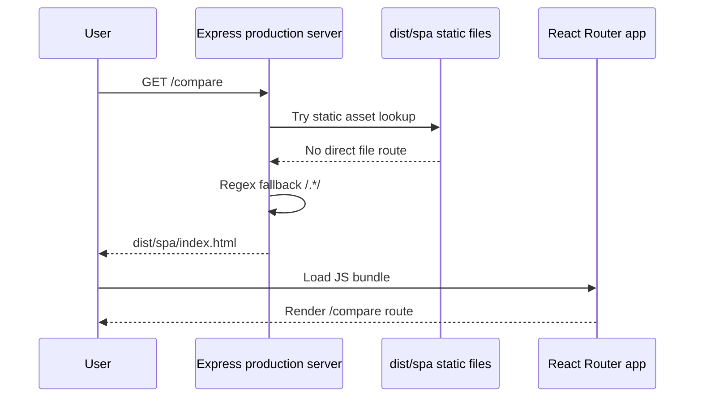

# Tech Spec: Whole-App Error Check and Fixes

## 1. Problem

The app needed a whole-codebase error check after adding the separate compare page and reviews section. Type checking and tests alone were not enough because the production server can still fail at runtime even when TypeScript and Vite builds pass.

Two real issues were found:

- `tsconfig.json` produced an IDE TypeScript diagnostic because `compilerOptions.baseUrl` is deprecated for TypeScript 6 and will stop functioning in TypeScript 7.
- `server/node-build.ts` used `app.get("*")` as the React Router production fallback. With Express 5 / `path-to-regexp`, that wildcard route throws at production startup.

## 2. Solution

I validated the full app with TypeScript, tests, production build, IDE diagnostics, and production smoke tests. I removed the deprecated TypeScript `baseUrl` option while keeping existing path aliases working, then changed the production SPA fallback route from the invalid Express 5 string wildcard to a regex catch-all.

## 3. What Was Implemented

### Fixed

- `tsconfig.json`
  - Removed deprecated `compilerOptions.baseUrl`.
  - Kept the existing alias mappings:
    - `@/*` → `./client/*`
    - `@shared/*` → `./shared/*`
  - Result: IDE diagnostics are now clean.

- `server/node-build.ts`
  - Changed the production React Router fallback from `app.get("*", ...)` to `app.get(/.*/, ...)`.
  - Result: the built Express 5 server starts successfully and serves SPA routes like `/compare`.

### Validated Existing Compare Page Work

- `client/App.tsx`
  - Confirms `/compare` is registered before the catch-all route.

- `client/pages/Compare.tsx`
  - Confirms the compare page imports shared stroke data and renders the compare table plus reviews section.

- `client/pages/Index.tsx`
  - Confirms the homepage imports shared data/components and links to `/compare`.

- `client/components/SiteHeader.tsx`
  - Confirms the shared header links Compare to `/compare`.

- `client/components/SiteFooter.tsx`
  - Confirms the shared footer links Compare to `/compare` and stroke anchors to homepage sections.

- `client/data/strokes.ts`
  - Confirms shared stroke and review data is available to both pages.

## 4. Architecture



Production request flow:



The key server-side change is the fallback route:

```mermaid
flowchart LR
  Old[app.get("*")] -->|Express 5 startup error| Failure[path-to-regexp Missing parameter name]
  New[app.get(/.*/)] --> Success[Server starts and serves SPA routes]
```

## 5. Findings

- `pnpm typecheck` passed before and after the fixes, but IDE diagnostics caught a future TypeScript compatibility problem in `tsconfig.json`.
- `pnpm test` passed with 1 test file and 5 tests.
- `pnpm build` passed before and after the fixes, producing:
  - `dist/spa/index.html`
  - `dist/server/node-build.mjs`
- Build success did not guarantee production runtime success. The initial production smoke test failed with:
  - `PathError: Missing parameter name at index ...`
  - Root cause: Express 5 no longer accepts the bare `"*"` route pattern.
- After changing the fallback to `/.*/`, production smoke tests passed:
  - `/` → `200 text/html`
  - `/compare` → `200 text/html`
  - `/api/ping` → `200 application/json`
- GitHub CLI investigation was attempted but blocked by workspace ACL policy, so the validation relied on local code, git history, build output, diagnostics, and smoke tests.

## 6. Alternatives Considered

- Add `"ignoreDeprecations": "6.0"` to `tsconfig.json`.
  - Rejected because it only suppresses the warning. Removing `baseUrl` is cleaner and keeps the project compatible with future TypeScript behavior.

- Use another Express wildcard syntax such as `"/*"` or named wildcard patterns.
  - Rejected because Express 5 wildcard string syntax is easy to get wrong across `path-to-regexp` versions. A regex catch-all is explicit and works for this SPA fallback.

- Skip production smoke testing because build passed.
  - Rejected because the actual runtime error only appeared when starting the built server.

## 7. Tech Debt & Risks

- `package-lock.json` is currently untracked while the project declares `pnpm` as the package manager. It should be reviewed before committing so the repository does not accidentally mix lockfile formats.
- `client/global.css` has unrelated uncommitted changes. They were included in build validation but were not part of the error fix.
- The build script uses `npm run build:client && npm run build:server` inside the `pnpm build` script, which emits npm config warnings in this environment:
  - `Unknown env config "verify-deps-before-run"`
  - `Unknown env config "_jsr-registry"`
  These are warnings, not build failures.
- There are no route-level UI tests for `/compare`; current confidence comes from typecheck, build, and production HTTP smoke tests.

## 8. Remaining Work

- Decide whether to remove or commit the untracked `package-lock.json`.
- Decide whether the unrelated `client/global.css` changes should remain.
- Optionally add a lightweight route smoke test or Playwright-style browser test for `/compare` and the shared navigation links.
- Optionally update `package.json` build scripts to avoid npm warnings by using package-manager-consistent scripts if desired.

## Validation Evidence

Commands run successfully after fixes:

- `pnpm typecheck`
- `pnpm test`
- `pnpm build`
- IDE diagnostics: no diagnostics found
- Production smoke test through built server:
  - `/` returned `200`
  - `/compare` returned `200`
  - `/api/ping` returned `200`
